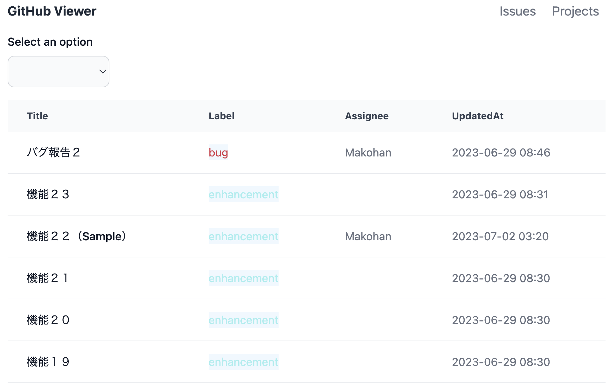
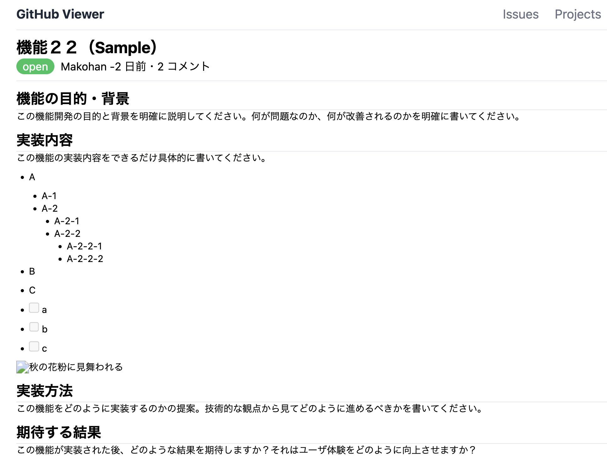

# GitHub Viewer

GitHub Viewer is a simple service for viewing data on GitHub.

## Details

This tool is designed for efficiently viewing Issues of a specific GitHub repository. By simply providing the information of the repository they wish to investigate as environment variables, users can retrieve a list of Issues. (Viewing of Projects is on the to-do list.)

## Sample

https://issues-viewer-kohl.vercel.app/

### Issue list



### Issue Detail



## Usage

First, copy the `.env.example` file and create a new `.env` file.

```bash
cp .env.example .env
```

Next, update the new `.env` file as follows.

```
OWNER=your GitHub username
REPO=the repository you want to view
GITHUB_TOKEN=your GitHub token
```

Finally, once the packages are installed, you can run it.

```bash
pnpm install

pnpm dev
```

## Not yet implemented

- [ ] Viewing of Projects
- [ ] ~~Displaying images in Issues"~~(no plan)
